# WikiWatch edit lifecycle and database flows

This guide describes the current backend-connected application, including immediate review opening and background queue admission.

When someone clicks a Wikipedia event, the review opens for reading and the app saves a shared review record in the background. Claiming, commenting, and making a decision are separate actions.

## Database tables

| Table | Purpose |
| --- | --- |
| `edits` | Shared queue: Wikipedia revision IDs, metadata, owner, and review status |
| `threads` | Discussions attached to an edit and a text selection |
| `comments` | Messages and replies inside those discussions |
| `audit` | Who performed an action and what changed |
| `events` | Small team-change notifications used by browser polling |
| `members` | Team accounts, password hashes, roles, and active status |
| `sessions` | Sign-in sessions, hashed tokens, expiry, and revocation |
| `preferences` | Personal settings, such as board column order |
| `workspace_lock` | Coordinates shared database mutations |

There is no separate queue or claims table. A queue item and its claim are fields in the same `edits` row.

The database stores revision IDs and metadata, not the complete old and new Wikipedia article text. The browser downloads that content directly from Wikipedia and computes the diff locally. Discussion anchors can store quoted text, but they are not full article copies.

## Shared rules for API requests

All endpoint paths below are relative to `/wikiwatch-service/v1`.

Protected requests read the session and member to check authentication and active status. Shared write requests acquire the `workspace_lock` row lock on PostgreSQL and recheck the member. Edit and thread updates also compare versions to reject stale changes.

A successful edit admission or transition saves its business records, audit entry, and team event in one transaction. Failed, uncommitted transactions roll back when their database session closes. Preference updates and authentication have their own write behavior and do not use the same audit/event recording pattern.

The `events` table contains team-change notifications. It is distinct from the incoming Wikimedia event stream.

## 1. A Wikipedia event arrives

A normal feed arrival affects only the browser. A lead's automatic admission can separately select events for persistence.

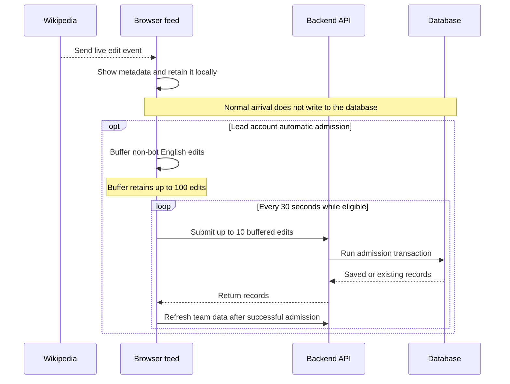

Automatic admission runs for a lead when the tab is visible, the browser is online, and no foreground mutation is pending. The buffer drops its oldest item when it exceeds 100. It removes selected items before submission; the current implementation does not automatically restore failed items to that buffer.

An edit can enter the database when someone opens it or when a lead's automatic submission selects it.

## 2. Click an edit that has not been saved

The review opens immediately. Reading and saving are independent tasks, although Wikipedia requests currently share a sequential request queue.

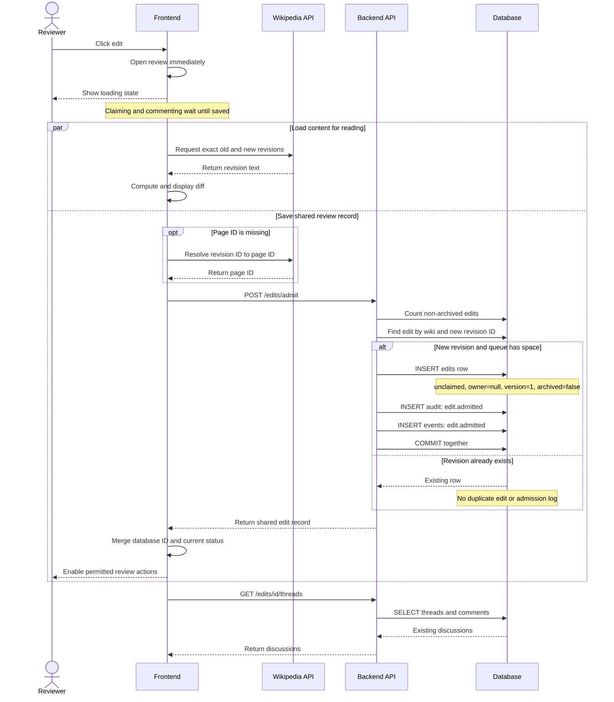

Clicking does not claim the edit. A new row starts as `unclaimed`; an existing row retains its current owner and status.

The frontend rejects demo edits or invalid revision IDs. It resolves missing page IDs in batches of up to 50 revisions per Wikipedia lookup. The backend validates the submitted metadata but does not independently fetch Wikipedia to verify it.

Queue admission saves:

- A UUID database ID and the wiki, page ID, and old/new revision IDs.
- Title, editor, Wikipedia edit comment, size change, timestamp, namespace, and bot flag.
- Admission timestamp, `status=unclaimed`, `owner_id=null`, `version=1`, and `archived=false`.
- One audit record and one team-change event for each newly inserted edit.

The full workspace is not reloaded as a prerequisite for opening the review. The admission response is merged into the frontend's feed and shared queue state.

## 3. Click an edit already saved

If the frontend already knows the database ID, admission is skipped. If it does not know the ID, admission looks up the existing record instead of duplicating it.

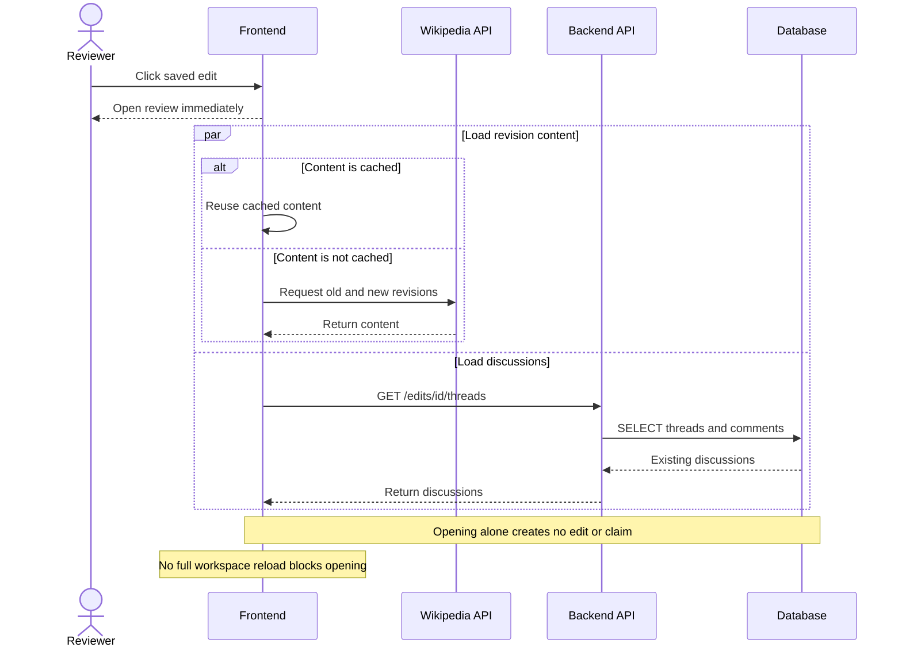

Duplicate detection uses `wiki + new_rev`, backed by a database uniqueness constraint. Admission can return an archived existing record; subsequent review mutations reject archived edits.

## 4. Reviewer claims, approves, flags, or releases an edit

These actions update the existing `edits` row.

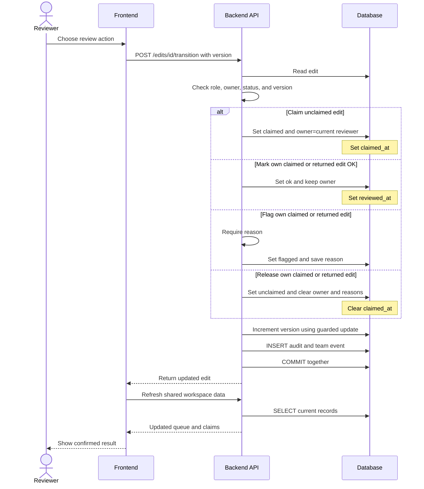

| Action | Before | After | Database ownership |
| --- | --- | --- | --- |
| Claim | `unclaimed` | `claimed` | Set current reviewer |
| Mark OK | `claimed` or `returned` | `ok` | Keep owner |
| Flag | `claimed` or `returned` | `flagged` | Keep owner |
| Release | `claimed` or `returned` | `unclaimed` | Clear owner |

A flag is a team review decision. It does not revert or modify Wikipedia. Returning to an unfinished state clears `reviewed_at`. Review transitions increment `version` and update the edit timestamp.

## 5. Lead assigns, returns, verifies, or reopens work

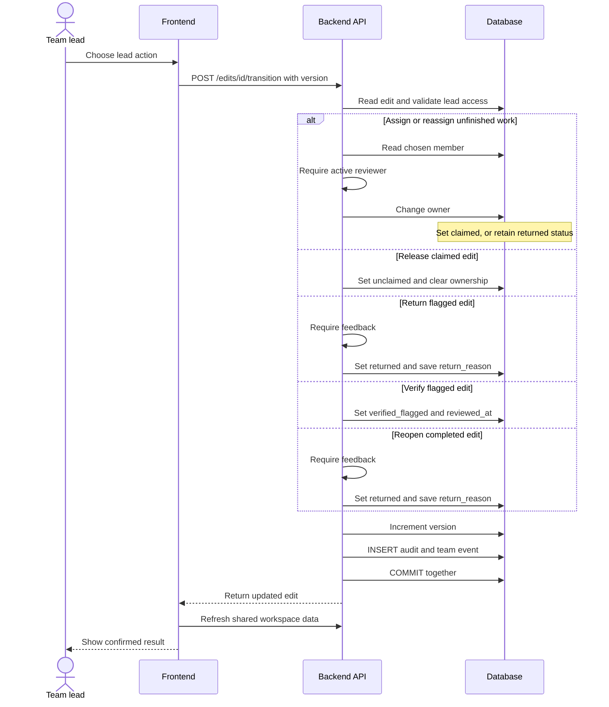

| Action | Allowed starting status | Result |
| --- | --- | --- |
| Assign/reassign | `unclaimed`, `claimed`, `returned` | New owner; `claimed`, or still `returned` |
| Lead release | `claimed` | `unclaimed`; clear ownership and claim timestamp |
| Return | `flagged` | `returned`; keep owner and flag reason, save feedback |
| Verify flag | `flagged` | `verified_flagged`; keep owner, set review timestamp |
| Reopen | `ok`, `verified_flagged` | `returned`; keep owner, save feedback, clear review timestamp |

Assigning unclaimed work sets `claimed_at`. Reassignment of already claimed or returned work retains its existing claim timestamp. The frontend requires the lead to load and inspect the source before verifying a flag.

## 6. Add a comment or reply

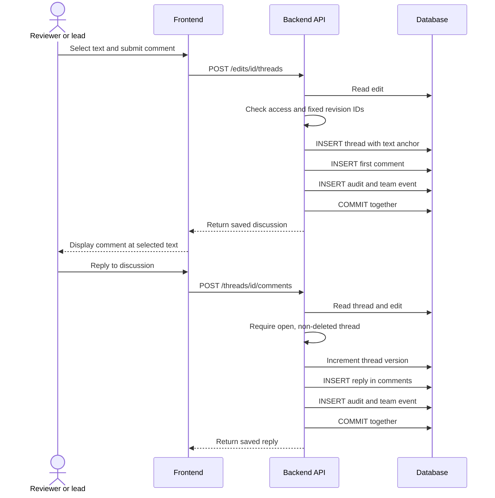

The thread stores the revision pair and a text anchor: side, line range, offsets, and quoted text. The backend checks that the anchor's revision IDs match the edit; it does not download the article to verify the quoted text. The frontend detects mismatched anchors.

Adding a discussion or reply does not claim or complete the edit. Reviewers and leads can comment on non-archived edits without owning their claims.

## 7. Resolve, reopen, or delete a discussion

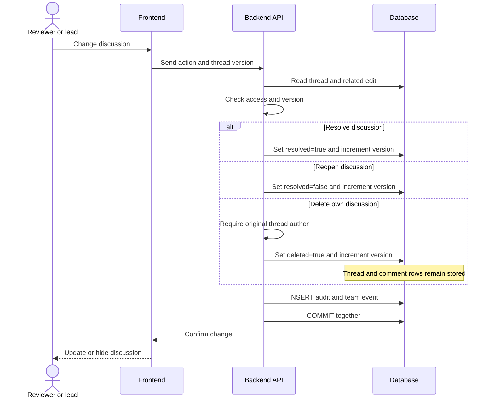

Deleting a thread is soft deletion. Its replies remain in the database but are hidden through the API. Resolving a discussion does not mark the edit OK; discussion state and review state are independent.

## 8. Other team members see changes

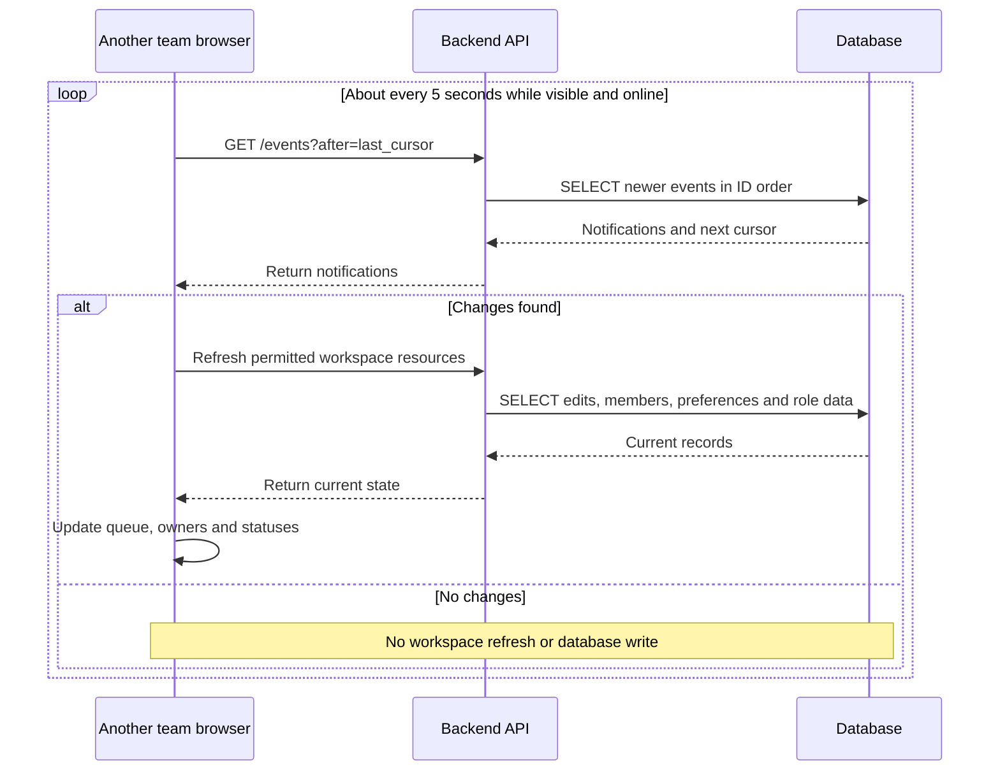

The notification means "something changed; fetch the current records." It is not a complete copy of an edit. Polling follows event pages until caught up and backs off after failures. The current frontend refresh loads queue pages of up to 100 records, along with other role-appropriate data.

## 9. Two people try to claim the same edit

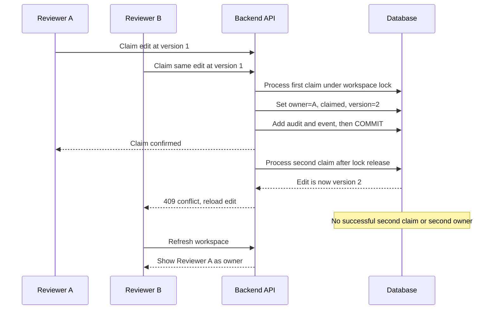

The version check and guarded update prevent a stale request from silently overwriting ownership. An invalid role or owner can cause a permission error; an invalid state or stale version causes a conflict. Required missing reasons cause validation errors.

## 10. Saving or content loading fails

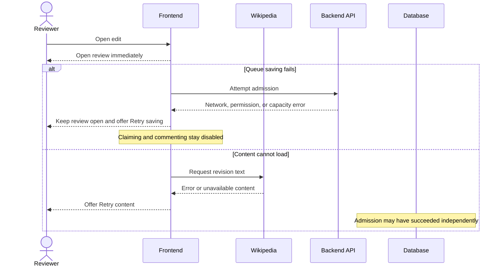

The active queue defaults to 10,000 non-archived edits. Existing revisions are returned without consuming another slot. A rejected admission transaction leaves no newly committed partial writes.

A network failure is ambiguous: the server may have committed before the response was lost. Retrying admission safely returns the existing row because admission is duplicate-aware. Content failure does not undo a successful admission.

### Batch review

The frontend opens selected edits together and submits unsaved edits in requests of up to 100. Missing page IDs are resolved in Wikipedia batches of up to 50. Each admission request has its own transaction, so an earlier successful request stays committed if a later request fails. Retrying safely finds previously saved revisions.

Open review items are retained through browser feed bursts. Saved review actions stay disabled while admission is pending, and unsaved items remain disabled after a failure. A full page refresh can require reloading state; an unsaved feed item is not guaranteed to remain available forever.

## 11. Admin archives an edit

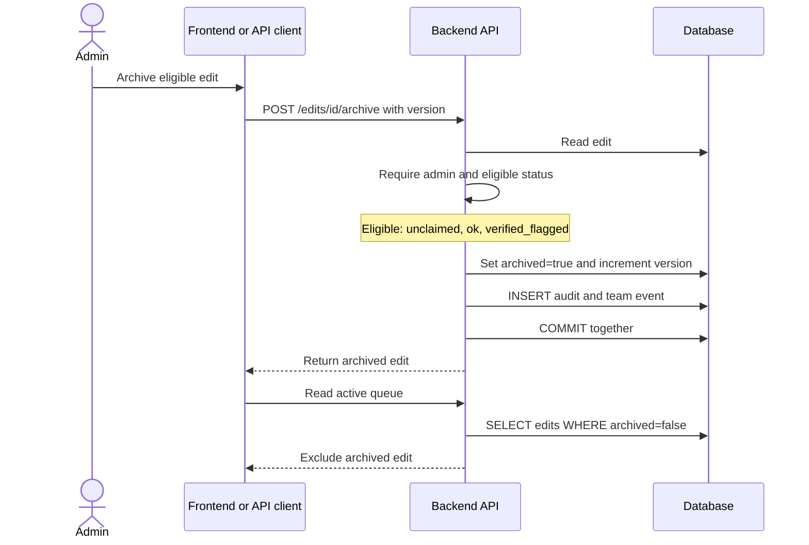

Archiving retains the edit, discussions, and history. It frees active queue capacity, not database storage. Archived edits cannot be reviewed or commented on. Completed review history remains available in retained records, and activity reporting includes archived edits within its time window.

## 12. Tick Viewed

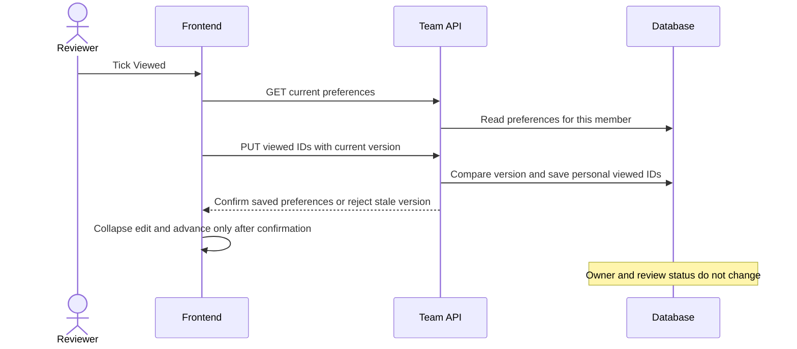

The connected review checkbox saves viewed IDs in member preferences. Conflicting changes fail visibly and can be retried. Viewed is personal reading progress, not a claim or decision.

## Example lifecycle in one edit row

| Step | Status | Owner | Version | Other changes |
| --- | --- | --- | --- | --- |
| Open and admit | `unclaimed` | None | 1 | Insert metadata, audit, and event |
| Dev claims | `claimed` | Dev | 2 | Set claim timestamp |
| Dev flags | `flagged` | Dev | 3 | Save flag reason |
| Sara returns | `returned` | Dev | 4 | Save feedback |
| Dev flags again | `flagged` | Dev | 5 | Save new reason, clear return feedback |
| Sara verifies | `verified_flagged` | Dev | 6 | Set review timestamp |
| Admin archives | `verified_flagged` | Dev | 7 | Set archived=true |

Every successful transition in this example adds an audit row and a team event. The same edit row survives throughout; transitions do not create a fresh queue item.

## Source references

Paths below are relative to the workspace root unless noted otherwise.

- `wikiwatch-web/src/RemoteWorkspace.tsx`: click handling, background admission, polling, feed retention, and retry UI.
- `wikiwatch-web/src/reviewOpening.ts`: immediate navigation and merging admission responses.
- `wikiwatch-web/src/backend.ts`: API requests, admission batching, and transition submission.
- `wikiwatch-web/src/wiki.ts`: revision metadata resolution and article content requests.
- `wikiwatch-web/src/ReviewPage.tsx`: content loading, comments, decision controls, and Viewed behavior.
- [Database models](../services/wikiwatch-service/app/models/entities.py).
- [Authentication and shared mutation dependency](../services/wikiwatch-service/app/dependencies/__init__.py).
- [Edit admission and transitions](../services/wikiwatch-service/app/services/edits.py).
- [Comment and thread mutations](../services/wikiwatch-service/app/services/comments.py).
- [Audit and event recording](../services/wikiwatch-service/app/services/base.py).
- [Guarded version updates](../services/wikiwatch-service/app/repositories/workspace.py).
- [Reporting and team synchronization](../services/wikiwatch-service/app/api/v1/endpoints/reporting.py).
- [Preference persistence](../services/wikiwatch-service/app/services/preferences.py).

Opening saves the work item. Claiming assigns responsibility. Reviewing records a decision. Commenting records discussion. None of these actions modifies Wikipedia itself.
